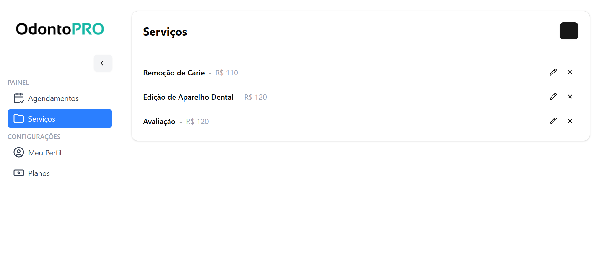
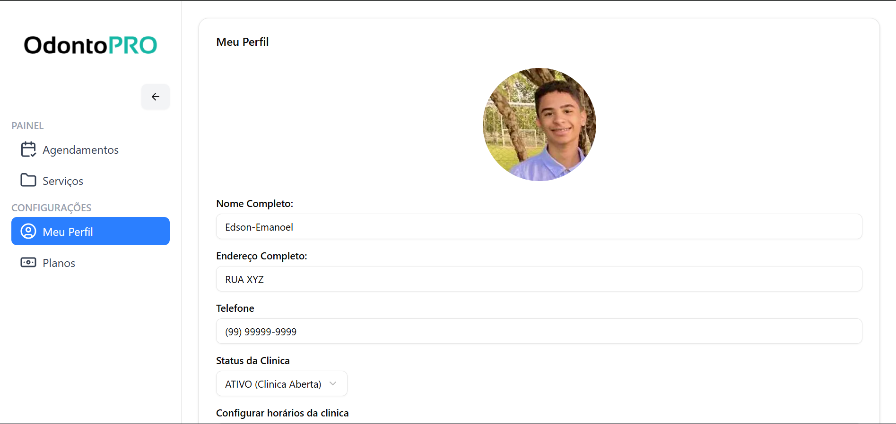
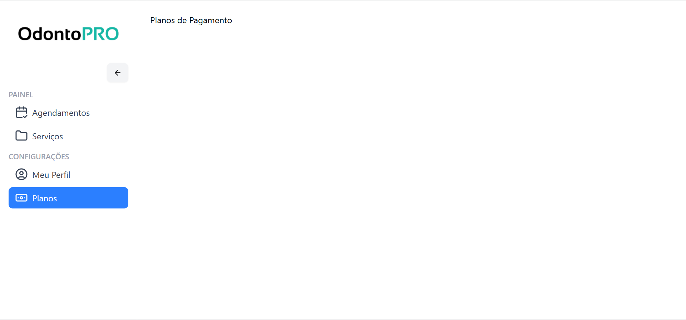

# OdontoPro

**Sistema completo para gestão de clínicas odontológicas**  
_Aula atual: 54 (início do projeto)_

<div align="center">






</div>

---

# Tecnologias

<div align="center">

[](https://nextjs.org/)
[](https://react.dev/)
[](https://www.typescriptlang.org/)
[](https://tailwindcss.com/)
[](https://ui.shadcn.com/)
[](https://www.prisma.io/)
[](https://authjs.dev/)

</div>

---

# Como rodar

```bash
git clone https://github.com/seu-usuario/odontopro.git
cd odontopro
npm install
cp .env.example .env.local   # configure DATABASE_URL e NEXTAUTH_SECRET
npx prisma migrate dev
npm run dev
```
